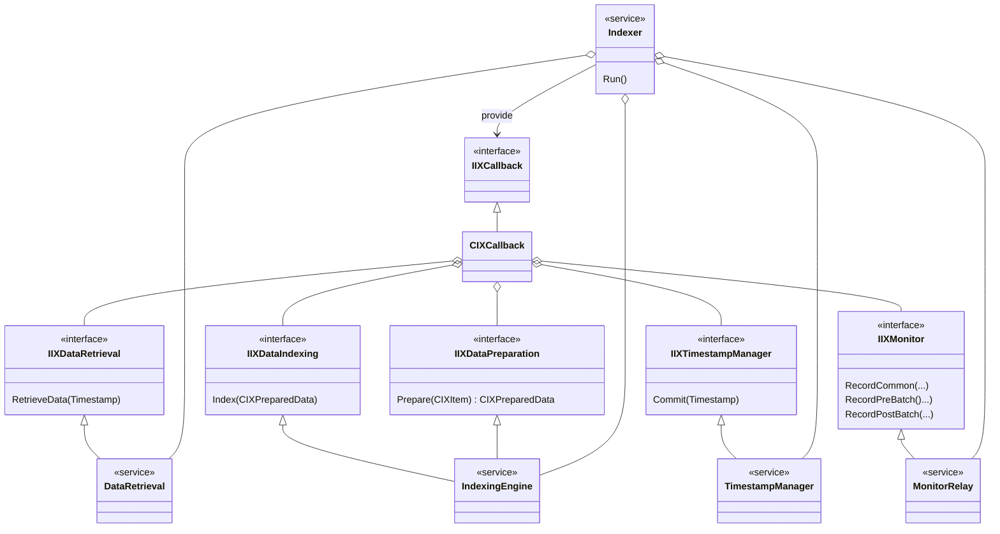
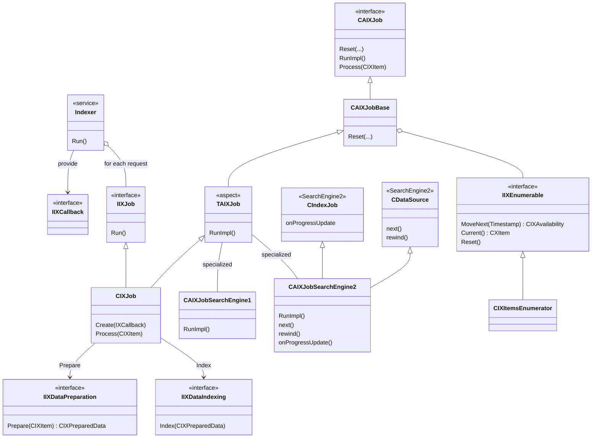

IXSample is a simple implementation for crawling (a.k.a. indexing) some chronologically ordered data by using logical timestamps. Logical timestamp values can be compared to each other for mutual ordering, but no absolute times can be determined from them. The crawling itself is organized as two nested iterations, first divided into batches and then into chunks. Each chunk represents one unit of retrieving data, whereas each batch is completed by committing the timestamp value (providing the next starting point after a possible failure).




---


---
```
Job being created.
Enumerator being initialized.
Batch being initialized.
   Chunk being initialized.
      Retrieved 10 items. Latest visible timestamp is 10.
         ts( 1 ), data( 2,3,4 ) ...indexed.
         ts( 2 ), data( 4,6,8 ) ...indexed.
         ts( 3 ), data( 6,9,12 ) ...indexed.
         ts( 4 ), data( 8,12,16 ) ...indexed.
         ts( 5 ), data( 10,15,20 ) ...indexed.
         ts( 6 ), data( 12,18,24 ) ...indexed.
         ts( 7 ), data( 14,21,28 ) ...indexed.
         ts( 8 ), data( 16,24,32 ) ...indexed.
         ts( 9 ), data( 18,27,36 ) ...indexed.
         ts( 10 ), data( 20,30,40 ) ...indexed.
      Perhaps more data available.
   Chunk being initialized.
      Retrieved 10 items. Latest visible timestamp is 20.
         ts( 11 ), data( 22,33,44 ) ...indexed.
         ts( 12 ), data( 24,36,48 ) ...indexed.
         ts( 13 ), data( 26,39,52 ) ...indexed.
         ts( 14 ), data( 28,42,56 ) ...indexed.
         ts( 15 ), data( 30,45,60 ) ...indexed.
         ts( 16 ), data( 32,48,64 ) ...indexed.
         ts( 17 ), data( 34,51,68 ) ...indexed.
         ts( 18 ), data( 36,54,72 ) ...indexed.
         ts( 19 ), data( 38,57,76 ) ...indexed.
         ts( 20 ), data( 40,60,80 ) ...indexed.
      Perhaps more data available.
Committed at ts( 20 ) after 20 items.
Batch being initialized.
   Chunk being initialized.
      Retrieved 10 items. Latest visible timestamp is 30.
         ts( 21 ), data( 42,63,84 ) ...indexed.
         ts( 22 ), data( 44,66,88 ) ...indexed.
         ts( 23 ), data( 46,69,92 ) ...indexed.
         ts( 24 ), data( 48,72,96 ) ...indexed.
         ts( 25 ), data( 50,75,100 ) ...indexed.
         ts( 26 ), data( 52,78,104 ) ...indexed.
         ts( 27 ), data( 54,81,108 ) ...indexed.
         ts( 28 ), data( 56,84,112 ) ...indexed.
         ts( 29 ), data( 58,87,116 ) ...indexed.
         ts( 30 ), data( 60,90,120 ) ...indexed.
      Perhaps more data available.
   Chunk being initialized.
      Retrieved 10 items. Latest visible timestamp is 40.
         ts( 31 ), data( 62,93,124 ) ...indexed.
         ts( 32 ), data( 64,96,128 ) ...indexed.
         ts( 33 ), data( 66,99,132 ) ...indexed.
         ts( 34 ), data( 68,102,136 ) ...indexed.
         ts( 35 ), data( 70,105,140 ) ...indexed.
         ts( 36 ), data( 72,108,144 ) ...indexed.
         ts( 37 ), data( 74,111,148 ) ...indexed.
         ts( 38 ), data( 76,114,152 ) ...indexed.
         ts( 39 ), data( 78,117,156 ) ...indexed.
         ts( 40 ), data( 80,120,160 ) ...indexed.
      Perhaps more data available.
Committed at ts( 40 ) after 20 items.
Batch being initialized.
   Chunk being initialized.
      Retrieved 10 items. Latest visible timestamp is 50.
         ts( 41 ), data( 82,123,164 ) ...indexed.
         ts( 42 ), data( 84,126,168 ) ...indexed.
         ts( 43 ), data( 86,129,172 ) ...indexed.
         ts( 44 ), data( 88,132,176 ) ...indexed.
         ts( 45 ), data( 90,135,180 ) ...indexed.
         ts( 46 ), data( 92,138,184 ) ...indexed.
         ts( 47 ), data( 94,141,188 ) ...indexed.
         ts( 48 ), data( 96,144,192 ) ...indexed.
         ts( 49 ), data( 98,147,196 ) ...indexed.
         ts( 50 ), data( 100,150,200 ) ...indexed.
      Perhaps more data available.
   Chunk being initialized.
      Retrieved 10 items. Latest visible timestamp is 60.
         ts( 51 ), data( 102,153,204 ) ...indexed.
         ts( 52 ), data( 104,156,208 ) ...indexed.
         ts( 53 ), data( 106,159,212 ) ...indexed.
         ts( 54 ), data( 108,162,216 ) ...indexed.
         ts( 55 ), data( 110,165,220 ) ...indexed.
         ts( 56 ), data( 112,168,224 ) ...indexed.
         ts( 57 ), data( 114,171,228 ) ...indexed.
         ts( 58 ), data( 116,174,232 ) ...indexed.
         ts( 59 ), data( 118,177,236 ) ...indexed.
         ts( 60 ), data( 120,180,240 ) ...indexed.
      Perhaps more data available.
Committed at ts( 60 ) after 20 items.
Batch being initialized.
   Chunk being initialized.
      Retrieved 10 items. Latest visible timestamp is 70.
         ts( 61 ), data( 122,183,244 ) ...indexed.
         ts( 62 ), data( 124,186,248 ) ...indexed.
         ts( 63 ), data( 126,189,252 ) ...indexed.
         ts( 64 ), data( 128,192,256 ) ...indexed.
         ts( 65 ), data( 130,195,260 ) ...indexed.
         ts( 66 ), data( 132,198,264 ) ...indexed.
         ts( 67 ), data( 134,201,268 ) ...indexed.
         ts( 68 ), data( 136,204,272 ) ...indexed.
         ts( 69 ), data( 138,207,276 ) ...indexed.
         ts( 70 ), data( 140,210,280 ) ...indexed.
      Perhaps more data available.
   Chunk being initialized.
      Retrieved 10 items. Latest visible timestamp is 80.
         ts( 71 ), data( 142,213,284 ) ...indexed.
         ts( 72 ), data( 144,216,288 ) ...indexed.
         ts( 73 ), data( 146,219,292 ) ...indexed.
         ts( 74 ), data( 148,222,296 ) ...indexed.
         ts( 75 ), data( 150,225,300 ) ...indexed.
         ts( 76 ), data( 152,228,304 ) ...indexed.
         ts( 77 ), data( 154,231,308 ) ...indexed.
         ts( 78 ), data( 156,234,312 ) ...indexed.
         ts( 79 ), data( 158,237,316 ) ...indexed.
         ts( 80 ), data( 160,240,320 ) ...indexed.
      Perhaps more data available.
Committed at ts( 80 ) after 20 items.
Batch being initialized.
   Chunk being initialized.
      Retrieved 1 items. Latest visible timestamp is 81.
         ts( 81 ), data( 162,243,324 ) ...indexed.
      No more data available.
Committed at ts( 81 ) after 1 items.
      No more data available.

Indexed 81 items.

class CIXCallback:                      0 remaining     1 up,   1 down.
class CIXDataRetrieval:                 0 remaining     1 up,   1 down.
class CIXIndexing:                      0 remaining     1 up,   1 down.
class CIXItemsBatched:                  0 remaining     5 up,   5 down.
class CIXItemsChunked:                  0 remaining     9 up,   9 down.
class CIXItemsEnumerator:               0 remaining     1 up,   1 down.
class CIXJob<class CAIXJobCombined>:    0 remaining     1 up,   1 down.

```
