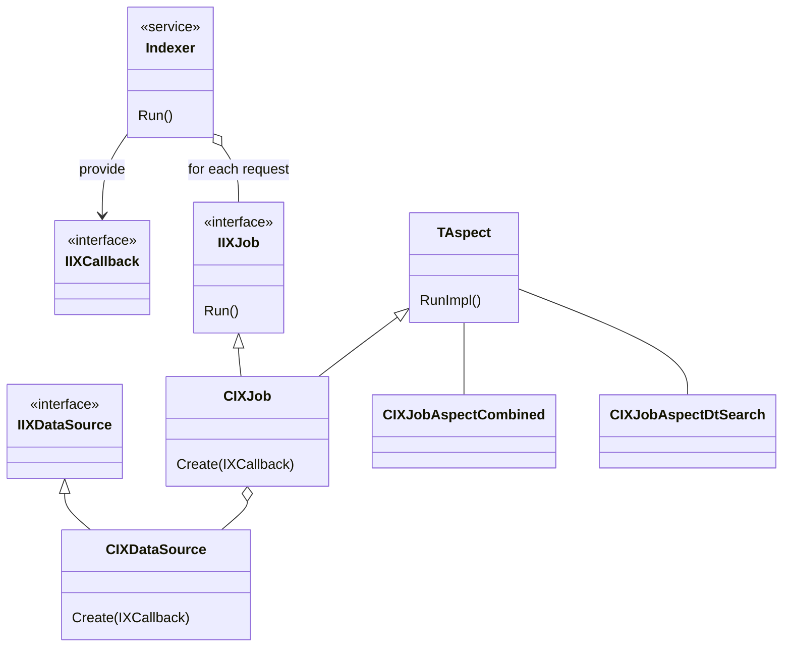

```mermaid
classDiagram

class IIXCallback
<<interface>> IIXCallback

class IIXTimestampManager
<<interface>> IIXTimestampManager
IIXTimestampManager : Commit(Timestamp)
class TimestampManager
<<external>> TimestampManager
IIXTimestampManager <|-- TimestampManager

class IIXIndexingEngine 
<<interface>> IIXIndexingEngine
IIXIndexingEngine : Index(CIXItem)
class IndexingEngine
<<external>> IndexingEngine
IIXIndexingEngine <|-- IndexingEngine

class IIXDataRetrieval
<<interface>> IIXDataRetrieval
IIXDataRetrieval : RetrieveData(Timestamp) 
class DataRetrieval
<<external>> DataRetrieval
IIXDataRetrieval <|-- DataRetrieval

class IIXMonitor
<<interface>> IIXMonitor
IIXMonitor : RecordCommon(...)
IIXMonitor : RecordPreBatch()...)
IIXMonitor : RecordPostBatch(...)
class MonitorRelay
<<external>> MonitorRelay
IIXMonitor <|-- MonitorRelay

IIXCallback <|-- CIXCallback
CIXCallback o-- IIXDataRetrieval
CIXCallback o-- IIXIndexingEngine
CIXCallback o-- IIXTimestampManager
CIXCallback o-- IIXMonitor

class Indexer
<<service>> Indexer

Indexer : Run()
Indexer --> IIXCallback : provide
Indexer o-- DataRetrieval
Indexer o-- MonitorRelay
Indexer o-- IndexingEngine
Indexer o-- TimestampManager


```

---

```mermaid
classDiagram

class IIXCallback
<<interface>> IIXCallback

class IIXDataSource
<<interface>> IIXDataSource
IIXDataSource <|-- CIXDataSource
CIXDataSource : Create( IXCallback )

class TAspect

class IIXJob
<<interface>> IIXJob
IIXJob : Run()
IIXJob <|-- CIXJob
CIXJob : Create( IXCallback )
CIXJob o-- CIXDataSource
TAspect <|-- CIXJob
TAspect : RunImpl()
TAspect -- CIXJobAspectCombined
TAspect -- CIXJobAspectDtSearch

class Indexer
<<service>> Indexer

Indexer : Run()
Indexer --> IIXCallback : provide
Indexer o-- IIXJob : for each request


```

---

```mermaid
classDiagram

class IIXEnumerable
<<interface>> IIXEnumerable
IIXEnumerable : MoveNext( Timestamp ) CIXAvailability
IIXEnumerable : Current() CXItem
IIXEnumerable : Reset()
IIXEnumerable <|-- CIXItemsConsumed
IIXEnumerable <|-- CIXItemsBatched
IIXEnumerable <|-- CIXItemsChunked

class IIXTimestampManager
<<interface>> IIXTimestampManager
IIXTimestampManager : Commit(Timestamp)

class IIXDataRetrieval
<<interface>> IIXDataRetrieval
IIXDataRetrieval : RetrieveData(Timestamp) 
class DataRetrieval
<<external>> DataRetrieval
IIXDataRetrieval <|-- DataRetrieval

CIXItemsConsumed o-- CIXItemsBatched
CIXItemsConsumed : Create( IIXCallback )

CIXItemsBatched o-- CIXItemsChunked
CIXItemsBatched : Create( IIXCallback )
CIXItemsBatched --> IIXTimestampManager : Commit

CIXItemsChunked o-- "*" CIXItem
CIXItemsChunked : Create( IIXCallback )
CIXItemsChunked --> IIXDataRetrieval : Retrieve data


```