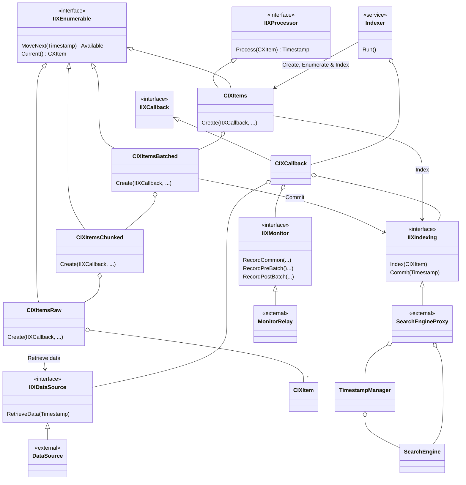

```mermaid
classDiagram

class IIXEnumerable
<<interface>> IIXEnumerable
IIXEnumerable : MoveNext( Timestamp ) Available
IIXEnumerable : Current() CXItem

class IIXProcessor
<<interface>> IIXProcessor
IIXProcessor : Process( CXItem) Timestamp

class IIXDataSource
<<interface>> IIXDataSource
IIXDataSource : RetrieveData(Timestamp) 

class IIXCallback
<<interface>> IIXCallback

IIXProcessor <|-- CIXItems
IIXEnumerable <|-- CIXItems
IIXEnumerable <|-- CIXItemsBatched
IIXEnumerable <|-- CIXItemsChunked
IIXEnumerable <|-- CIXItemsRaw

CIXItems o-- CIXItemsBatched
CIXItemsBatched o-- CIXItemsChunked
CIXItemsChunked o-- CIXItemsRaw
CIXItemsRaw o-- "*" CIXItem

CIXItems : Create( IIXCallback, ...)
CIXItemsBatched : Create( IIXCallback, ...)
CIXItemsChunked : Create( IIXCallback, ...)
CIXItemsRaw : Create( IIXCallback, ...)

class DataSource
<<external>> DataSource
IIXDataSource <|-- DataSource

class IIXIndexing 
<<interface>> IIXIndexing
IIXIndexing : Index(CIXItem)
IIXIndexing : Commit(Timestamp)

class SearchEngineProxy
<<external>> SearchEngineProxy
IIXIndexing <|-- SearchEngineProxy

SearchEngineProxy o-- TimestampManager
TimestampManager o-- SearchEngine
SearchEngineProxy o-- SearchEngine

class IIXMonitor
<<interface>> IIXMonitor
IIXMonitor : RecordCommon(...)
IIXMonitor : RecordPreBatch()...)
IIXMonitor : RecordPostBatch(...)

class MonitorRelay
<<external>> MonitorRelay
IIXMonitor <|-- MonitorRelay

CIXItemsRaw --> IIXDataSource : Retrieve data
CIXItemsBatched --> IIXIndexing : Commit
CIXItems --> IIXIndexing : Index

IIXCallback <|-- CIXCallback
CIXCallback o-- IIXDataSource
CIXCallback o-- IIXIndexing
CIXCallback o-- IIXMonitor

%%CIXItems o-- IIXCallback
%%CIXItemsBatched o-- IIXCallback
%%CIXItemsChunked o-- IIXCallback

class Indexer
<<service>> Indexer

Indexer --> CIXItems : Create, Enumerate & Index
Indexer : Run()
Indexer o-- CIXCallback


```