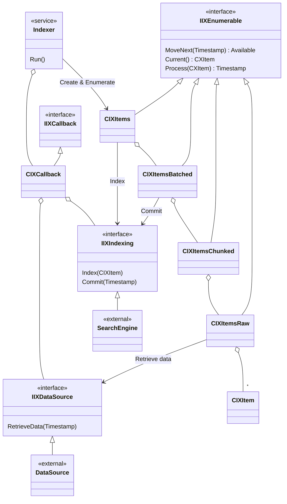

```mermaid
classDiagram

class IIXEnumerable
<<interface>> IIXEnumerable
IIXEnumerable : MoveNext( Timestamp ) Available
IIXEnumerable : Current() CXItem
IIXEnumerable : Process( CXItem) Timestamp

class IIXDataSource
<<interface>> IIXDataSource
IIXDataSource : RetrieveData(Timestamp) 

class IIXIndexing 
<<interface>> IIXIndexing
IIXIndexing : Index(CIXItem)
IIXIndexing : Commit(Timestamp)

class IIXCallback
<<interface>> IIXCallback

IIXEnumerable <|-- CIXItems
IIXEnumerable <|-- CIXItemsBatched
IIXEnumerable <|-- CIXItemsChunked
IIXEnumerable <|-- CIXItemsRaw

CIXItems o-- CIXItemsBatched
CIXItemsBatched o-- CIXItemsChunked
CIXItemsChunked o-- CIXItemsRaw
CIXItemsRaw o-- "*" CIXItem

class DataSource
<<external>> DataSource
IIXDataSource <|-- DataSource

class SearchEngine
<<external>> SearchEngine
IIXIndexing <|-- SearchEngine

CIXItemsRaw --> IIXDataSource : Retrieve data
CIXItemsBatched --> IIXIndexing : Commit
CIXItems --> IIXIndexing : Index

IIXCallback <|-- CIXCallback
CIXCallback o-- IIXDataSource
CIXCallback o-- IIXIndexing

%%CIXItems o-- IIXCallback
%%CIXItemsBatched o-- IIXCallback
%%CIXItemsChunked o-- IIXCallback

class Indexer
<<service>> Indexer

Indexer --> CIXItems : Create & Enumerate
Indexer : Run()
Indexer o-- CIXCallback


```