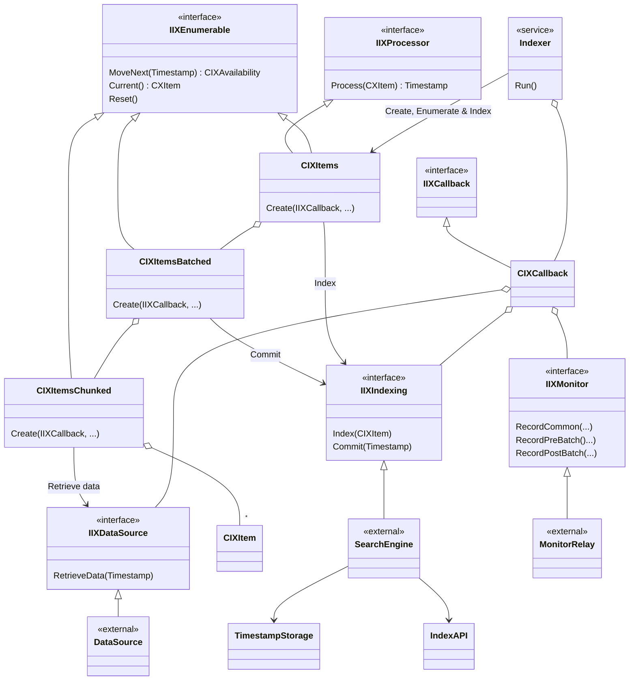

```mermaid
classDiagram

class IIXEnumerable
<<interface>> IIXEnumerable
IIXEnumerable : MoveNext( Timestamp ) CIXAvailability
IIXEnumerable : Current() CXItem
IIXEnumerable : Reset()

class IIXProcessor
<<interface>> IIXProcessor
IIXProcessor : Process( CXItem) Timestamp

class IIXDataSource
<<interface>> IIXDataSource
IIXDataSource : RetrieveData(Timestamp) 

class IIXCallback
<<interface>> IIXCallback

IIXProcessor <|-- CIXItems
IIXEnumerable <|-- CIXItems
IIXEnumerable <|-- CIXItemsBatched
IIXEnumerable <|-- CIXItemsChunked

CIXItems o-- CIXItemsBatched
CIXItemsBatched o-- CIXItemsChunked
CIXItemsChunked o-- "*" CIXItem

CIXItems : Create( IIXCallback, ...)
CIXItemsBatched : Create( IIXCallback, ...)
CIXItemsChunked : Create( IIXCallback, ...)

class DataSource
<<external>> DataSource
IIXDataSource <|-- DataSource


class IIXIndexing 
<<interface>> IIXIndexing
IIXIndexing : Index(CIXItem)
IIXIndexing : Commit(Timestamp)

class SearchEngine
<<external>> SearchEngine
IIXIndexing <|-- SearchEngine

SearchEngine --> TimestampStorage
SearchEngine --> Index API

class IIXMonitor
<<interface>> IIXMonitor
IIXMonitor : RecordCommon(...)
IIXMonitor : RecordPreBatch()...)
IIXMonitor : RecordPostBatch(...)

class MonitorRelay
<<external>> MonitorRelay
IIXMonitor <|-- MonitorRelay

CIXItemsChunked --> IIXDataSource : Retrieve data
CIXItemsBatched --> IIXIndexing : Commit
CIXItems --> IIXIndexing : Index

IIXCallback <|-- CIXCallback
CIXCallback o-- IIXDataSource
CIXCallback o-- IIXIndexing
CIXCallback o-- IIXMonitor

%%CIXItems o-- IIXCallback
%%CIXItemsBatched o-- IIXCallback
%%CIXItemsChunked o-- IIXCallback

class Indexer
<<service>> Indexer

Indexer --> CIXItems : Create, Enumerate & Index
Indexer : Run()
Indexer o-- CIXCallback


```